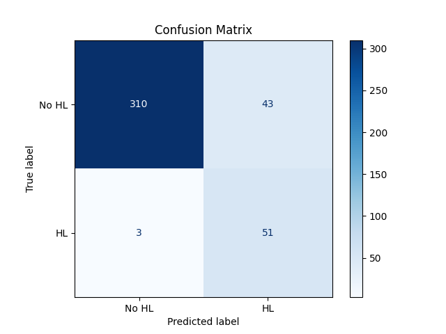

# Model Results

## Model: UNI_LSTM

### Without Preprocessing (all features used)
- **Test Accuracy:** 0.8068  
- **Test Precision:** 0.3143  
- **Test Recall:** 0.8250  
- **Test F1 Score:** 0.4552  
- **Metrics:** `{'accuracy': 0.8068, 'precision': 0.3143, 'recall': 0.8250, 'f1_score': 0.4552}`  

---

### With Preprocessing (Selected Features 0, no FFT for Halpha)
- **Test Accuracy:** 0.8532  
- **Test Precision:** 0.4454  
- **Test Recall:** 0.7910  
- **Test F1 Score:** 0.5699  
- **Metrics:** `{'accuracy': 0.8532, 'precision': 0.4454, 'recall': 0.7910, 'f1_score': 0.5699}`  
- **Confusion Matrix:**  
  

---

### With Preprocessing (Selected Features 0, FFT for Halpha)
- **Test Accuracy:** 0.8017  
- **Test Precision:** 0.3563  
- **Test Recall:** 0.9254  
- **Test F1 Score:** 0.5145  
- **Metrics:** `{'accuracy': 0.8017, 'precision': 0.3563, 'recall': 0.9254, 'f1_score': 0.5145}`  
- **Confusion Matrix:**  
  

---

### With Preprocessing (Selected Features 1, no FFT for Halpha)
- **Test Accuracy:** 0.8399  
- **Test Precision:** 0.4203  
- **Test Recall:** 0.8529  
- **Test F1 Score:** 0.5631  
- **Metrics:** `{'accuracy': 0.8399, 'precision': 0.4203, 'recall': 0.8529, 'f1_score': 0.5631}`  
- **Confusion Matrix:**  
  

---

### With Preprocessing (Selected Features 1, FFT for Halpha)
- **Test Accuracy:** 0.7801  
- **Test Precision:** 0.3520  
- **Test Recall:** 0.7683  
- **Test F1 Score:** 0.4828  
- **Metrics:** `{'accuracy': 0.7801, 'precision': 0.3520, 'recall': 0.7683, 'f1_score': 0.4828}`  
- **Confusion Matrix:**  
  

# Model: BI_LSTM

### Test Execution Order

1. **Initial Tests:**  
   - Started withunprocessed data and preprocessed data `features 0` and `features 1`, both with and without FFT.  
   - Evaluated combinations with `tw = 0.1` and `tw = 0.2`.  

2. **Focused Analysis:**  
   - For `features 0`, tested with and without FFT for `tw = 0.2` over 500 steps.  
   - Results indicated better F1 with preprocessed data and  that `features 0` without FFT was the best-performing configuration.

3. **Extended Tests:**  
   - Tested `features 0` without FFT with `tw = 0.3`, showing slight improvement but at a high computational cost.  
   - Increased the number of steps to 2000 for `features 0` (no FFT, `tw = 0.2`), varying the threshold between `0.5` and `0.6`. Threshold `0.5` proved optimal, as `0.6` caused excessive false negatives.

4. **Confirmation Tests:**  
   - Ran preprocessed data `features 0` and `features 1`, both with and without FFT for `tw = 0.2` and 2000 steps to confirm the best setup.  
   - Similarly, tested `features 1` (with and without FFT) under the same conditions (`tw = 0.2`, 2000 steps), reconfirming that `features 0` without FFT remains the best combination.

5. **Future Considerations:**  
   - Although `tw = 0.3` shows promise, the computational cost makes it impractical for routine testing. Future studies could explore larger time windows with better resources.

We also tried different number of time steps taken for time windows. So for example when we double the window, we investigated both reducing the number of steps taken, in addition to the standard procedure of doubling them.
That way we investigated not only the size of the time window but the frequency of time sampled

### Key Findings

1. **Best Preprocessing:** `Features 0` without FFT performed best, especially with `tw = 0.2`, 2000 steps, and a threshold of 0.5.  
2. **Threshold Selection:** Threshold `0.5` balanced false positives and negatives; `0.6` caused too many false negatives.  
3. **FFT Impact:** Adding FFT generally reduced performance compared to no FFT.  
4. **Future Work:** `tw = 0.3` shows slight improvement but is computationally expensive. Testing larger `tw` is recommended when feasible.

Focus on `features 0` without FFT as the optimal setup and document alternative strategies for future analysis.

### Without Preprocessing (Selected Shots, tw = 0.1, steps = 1000, threshold = 0.5)
- **Test Loss:** 0.21361897885799408  
- **Test F1 Score:** 0.5923076868057251  
- **Metrics:** `{'loss': 0.21361897885799408, 'f1_score': 0.5923076868057251}`  
- **Confusion Matrix:**  
  

---
### With Preprocessing (Preprocessed Features: `preprocessed_features0_FFT`, tw = 0.1, steps = 1000, threshold = 0.5)
- **Test Loss:** 0.2533060312271118  
- **Test F1 Score:** 0.6351346969604492  
- **Metrics:** `{'loss': 0.2533060312271118, 'f1_score': 0.6351346969604492}`  
- **Confusion Matrix:**  
  
---
### With Preprocessing (Preprocessed Features: `preprocessed_features0_FFT`,  tw = 0.2, steps= 500, threshold = 0.5)
- **Test Loss:** 0.5799393057823181  
- **Test F1 Score:** 0.6546808481216431  
- **Metrics:** `{'loss': 0.5799393057823181, 'f1_score': 0.6546808481216431}`  
- **Confusion Matrix:**  
  

---

### With Preprocessing (Preprocessed Features: `preprocessed_features0_FFT`, tw = 0.2, steps = 2000, threshold = 0.5)
- **Test Loss:**  0.3847258687019348
- **Test F1 Score:** 0.4881095886230469
- **Metrics:** `{'loss': 0.3847258687019348, 'f1_score': 0.4881095886230469}`
 
---

### With Preprocessing (Preprocessed Features: `preprocessed_features0`,  tw = 0.2, steps= 500, threshold = 0.5)
- **Test Loss:** 0.386663556098938
- **Test F1 Score:** 0.7162814736366272
- **Metrics:** `{'loss': 0.386663556098938, 'f1_score': 0.7162814736366272}`  
- **Confusion Matrix:**  
  

---

### With Preprocessing (Preprocessed Features: `preprocessed_features0`, tw = 0.2, steps = 2000, threshold = 0.5)
- **Test Loss:** 0.3389345109462738
- **Test F1 Score:** 0.71932053565979
- **Metrics:** `{'loss': 0.3389345109462738, 'f1_score': 0.71932053565979}`
 

---

### With Preprocessing (Preprocessed Features: `preprocessed_features1_FFT`,  tw = 0.2, steps= 500, threshold = 0.5)
- **Test Loss:** 0.3394539952278137
- **Test F1 Score:**  0.6633915901184082
- **Metrics:** `{'loss': 0.3394539952278137, 'f1_score': 0.6633915901184082}`  
- **Confusion Matrix:**  
  

---

### With Preprocessing (Preprocessed Features: `preprocessed_features1`, tw = 0.2, steps= 500, , threshold = 0.5)
- **Test Loss:** 0.3808082938194275
- **Test F1 Score:** 0.5928400158882141
- **Metrics:** `{'loss': 0.3808082938194275, 'f1_score': 0.5928400158882141}`  
- **Confusion Matrix:**  
  
  
---

### With Preprocessing (Preprocessed Features: `preprocessed_features1`, tw = 0.2, steps = 2000, threshold = 0.5)
- **Test Loss:** 0.4066413640975952
- **Test F1 Score:** 0.675420880317688
- **Metrics:** `{'loss': 0.4066413640975952, 'f1_score': 0.675420880317688}`
 

---

### With Preprocessing (Preprocessed Features: `preprocessed_features1_FFT`, tw = 0.2, steps = 2000, threshold = 0.5)
- **Test Loss:** 0.36998897790908813
- **Test F1 Score:** 0.5935283899307251
- **Metrics:** `{'loss': 0.36998897790908813, 'f1_score': 0.5935283899307251}`
 

---

### With Preprocessing (Preprocessed Features: `preprocessed_features0`, tw = 0.3, steps = 3000, threshold = 0.5)
- **Test Loss:** 0.46984922885894775
- **Test F1 Score:** 0.7212232947349548
- **Metrics:** `{'loss': 0.46984922885894775, 'f1_score': 0.7212232947349548}`
  

---

### With Preprocessing (Preprocessed Features: `preprocessed_features0`, tw = 0.2, steps = 2000, threshold = 0.6)
- **Test Loss:** 0.33027663826942444  
- **Test F1 Score:** 0.2673565149307251  
- **Metrics:** `{'loss': 0.33027663826942444, 'f1_score': 0.2673565149307251}`  
    

