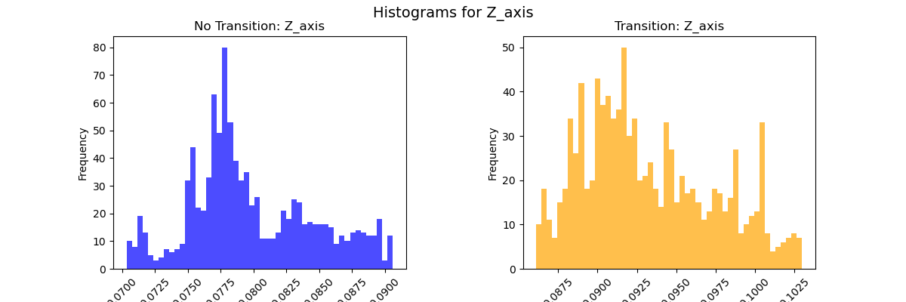
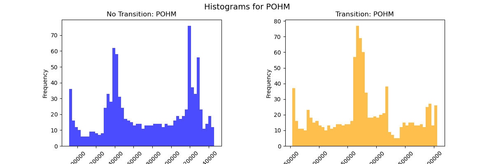
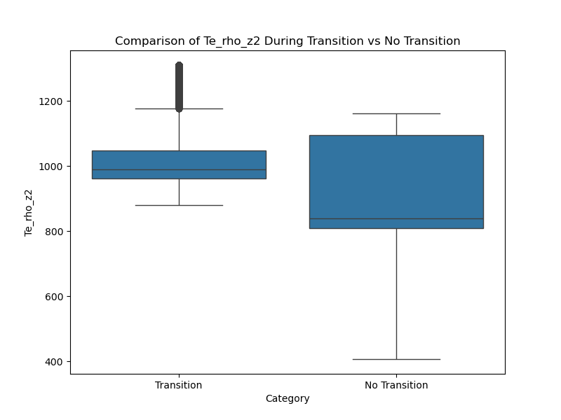

# Feature Selection

Most of the features were retained, even though their predictive power was not always certain. This decision was based on the hypothesis that, while certain features did not show clear patterns for prediction, the dynamics of plasma are highly complex. Therefore, potentially important features that could contribute to the model’s ability to capture the intricate behavior of plasma transitions were not excluded.

The features are:

---

## Wtot
Selected due to its direct relevance to the plasma energy.

  

---

## DML
Fully compensated plasma toroidal flux measured with the diamagnetic loop (Units = Wb).  
Steep drops in DML values are observed at HL transition times. These drops show a good correlation with Wtot, but are not exclusively indicative of HL transitions.

  
  

---

## FIR_LIDs_core
Far InfraRed (FIR) Line Integrated Density (LID) in the core plasma region, essential for understanding the average plasma density along a specific line of sight. Steep drops in FIR_LIDs_core values are observed at HL transition times, which correspond well with Wtot drops. However, these drops are not necessarily restricted to HL transitions.

  
  

---

## FIR_LIDs_LFS
Far InfraRed (FIR) Line Integrated Density (LID) in the Low Field Side (LFS) of the tokamak, where the magnetic field is weaker. Steep drops in FIR_LIDs_LFS values at HL transition times correlate with Wtot, but these drops are not exclusively due to HL transitions.

  
  

---

## FIR_LIDs_HFS
Far InfraRed (FIR) Line Integrated Density (LID) in the High Field Side (HFS) of the tokamak, where the magnetic field is stronger. Steep drops in FIR_LIDs_HFS values are observed at HL transition times, showing a good correlation with Wtot, though not uniquely indicating HL transitions.

  
  

---

## IPLA
Plasma current amplitude, measured in amperes (A). This feature did not show any distinct patterns or useful information in the first exploration, but may nonetheless be useful for prediction.

  
  

---

## IP
Total plasma current, measured in amperes (A). Although potentially informative, this feature did not display clear patterns in the initial analysis. The distribution showed a consistent single peak for transitions, whereas non-transition windows exhibited either a single peak or a more varied distribution.

  
  
  

---

## Halpha13
Hydrogen's Balmer-alpha spectral line related to radiation from the plasma. Spikes in Halpha13 are observed during HL transitions, typically preceded by high-frequency oscillations of moderate amplitude. Thus, the FFT of Halpha13 was used for further analysis.

  
  
  
  

---

## PECRH
The initial plot of this feature did not reveal any useful patterns that could help the predictions.

  
  

---

## Z_axis
Small drops are observed at HL times, but these are not restricted to HL events, and the utility of this feature remains uncertain.

  
  

---

## POHM
This feature did not reveal significant patterns during the initial analysis and was thus considered less useful.

  
  

---

## Ne_rho_z35
From PC1 during HL transition times. Changes in the slope are observed close to HL transition periods.

  
  

---

## Te_rho_z1 and Te_rho_z2
From PC2 during HL transition times. Changes in the slope are consistently observed around HL transition points.

  
  
  

